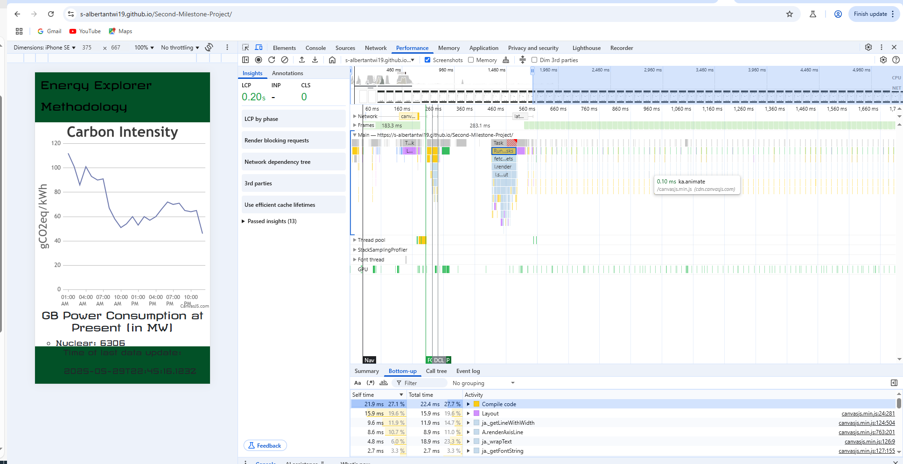

# Energy Explorer - A dive into 

[Project 2](https://s-albertantwi19.github.io/Second-Milestone-Project/) - Samuel Albert-Antwi 

## Energy Explorer - A dive into the GB energy landscape

This project was designed to verify my capabilities of the fetch API call in JavaScript whilst focusing on the energy as this is a sector of interest to me and where my skillset in data visualisations was birthed.

### About 

Energy Explorer is a graphical dashboard, detailing the historical carbon intensity for the GB zone up to T-1 hours (data availability for the past 23 hours up to the last hour), the current fuel mix of the GB zone, and the percentage breakdown of how green the fuel mix is at present. The source for the API is (https://portal.electricitymaps.com/dashboard)

## Table of Contents
1. [UX](/#user)
2. [Design](/#design)
3. [Deployment](/#deployment)
4. [Features](/#features)
5. [Testing](/#testing)
6. [Technologies Used](/#technologies)
7. [Credits and References](/#credits)

# User Experience UX
## User Stories

The aim of the design was to reflect a simple user experience - clear and concise features such as a graphical display of historial carbon intensity data and lists further detailing fuel mix.

# Design

The website has been created across 1 page as a dashboard for simpicity 

The chosen colour scheme has been selected to reflect the theme of 'green' energy as the UK works towards Net Zero 2050. The aim for the nation is cleaner electricity generation - this web app serves to track this.

# Deployment

To deploy the project I have utilised Github.

## My Repository

I created a new Github repository and cloned the repository in Visual Studio Code to develop locally. 

Whilst coding in Visual Studio Code, I ensured to save my development at each interval and regularly commit to the respository with commit messages through Visual Studio Code's source control panel. To verify my ability to use the terminal, I have also used git push/pull commands to commit to main.

## Hosting

In order to host the website, I navigated to Github and selected my public repository named 'Second-Milestone-Project' and proceeded as below:

- Settings > Pages
- Source: Select 'Deploy from a branch' from the dropdown menu
- Branch: Select 'Main' and 'root' from the dropdown menus
- Save

The website is now successfully deployed on GitHub Pages once you revert to your repository (initially it will say queued)

# Features

The feautures for the webpage were chosen for easy accessibility and a simple user experience.

## Navigation

For the web app I opted for a navigation menu, at the top of the page. The 'Energy Explorer'. In order to do so, the main page has a margin to allow space for this navbar. For smaller screens, the navbar goes to the top of the page

## Full Screen (Desktop) View

## Smaller Screen View

## IPhone SE View

## IPhone 12 Pro View

# Testing

In order to test, I used different web browsers using [Browser Stack](https://www.browserstack.com/) to test the respsonsive features of the website across multiple platforms. 

### Broswer Stack Testing

### CSS Validation

### HTML Validation

### JSHint Testing

### Lighthouse Testing Mobile vs Web

#### Desktop/Web

#### Mobile 

The performance of the app on a mobile device is slower than desktop version. Below I have attached an image to show my investigation into the performance. To increase the perfomance from a score of 86 to 89, I preconnected the Google fonts link for optimized loading.

# Technologies Used

## Languages

HTML, CSS and JavaScript have been used in the development of the website. 

## Technology

Github has been used to deploy and commit changes. 

# Credits and References

Throughout the development of the website I used the following references:

- Code Institute example code from JavaScript Essentials.
- [GeeksForGeeks](https://www.geeksforgeeks.org/)
- [W3Schools](W3Schools.com)
- [web.dev](https://web.dev/) for optimisation and insights into understanding jQuery
- [ElectricityMaps](https://portal.electricitymaps.com/dashboard) for understanding how to utilise the API call and the methodology of measuring data
- [CanvasJS](canvasjs.com) for understanding how to use JSON in data visualisation
- [Bootstrap](https://getbootstrap.com/docs/5.3/getting-started/introduction/) for responsive grid design and navbar design

# Author
Samuel Albert-Antwi

